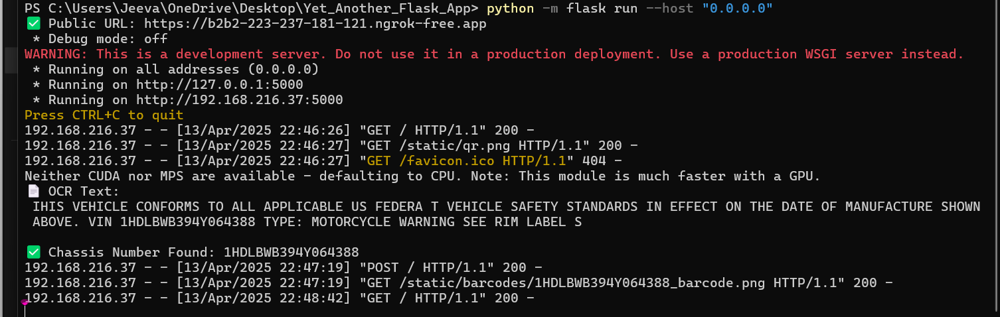
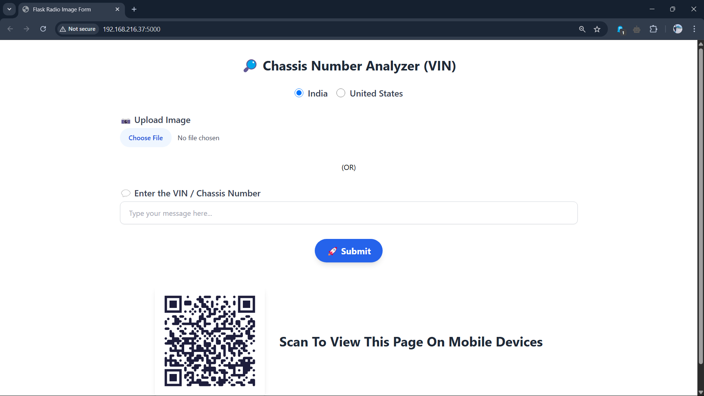
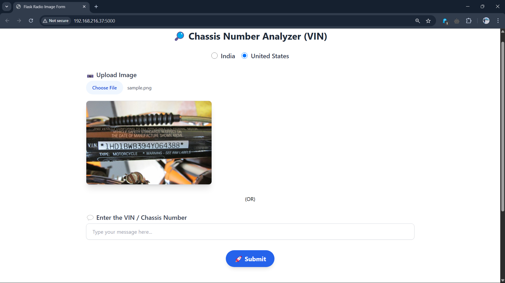
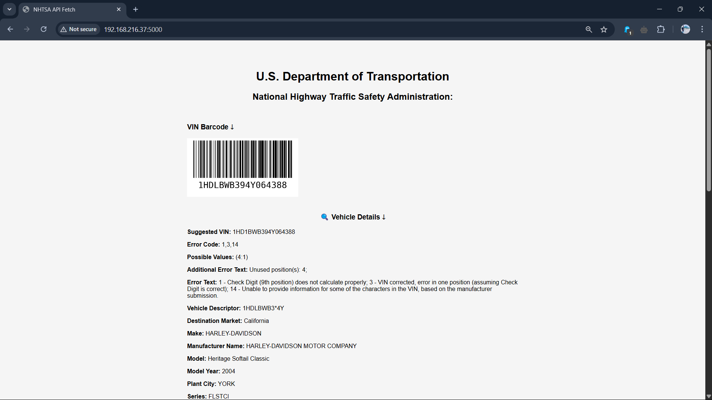

# Flask_VIN_Decoder
This repo contains code to decode the VIN / Chassis Number's from India and United States and It gives Vehicle Information as a output.

# Console

# Host : Local or Ngrok out
  
  
  

# Run
<code>pip install -r requirements.txt</code>
then
<code>python -m flask run --host "0.0.0.0"</code>
in the project directory.
